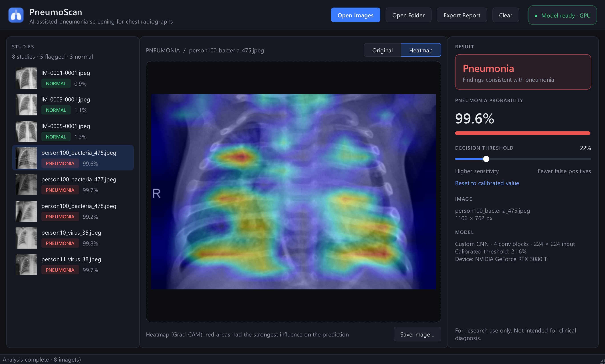

# PneumoScan

**Распознавание пневмонии по рентгеновским снимкам грудной клетки.**
Сверточная нейросеть на PyTorch, тепловые карты Grad-CAM и приложение для Windows.



**Авторы:** Соломонов Д. М., Калашников Н. Д.

---

## Содержание

- [Что умеет](#что-умеет)
- [Результаты](#результаты)
- [Быстрый старт](#быстрый-старт)
- [Как пользоваться](#как-пользоваться)
- [Обучение модели заново](#обучение-модели-заново)
- [Как это работает](#как-это-работает)
- [Структура проекта](#структура-проекта)
- [Частые проблемы](#частые-проблемы)
- [Данные](#данные)

---

## Что умеет

- Определяет по рентгеновскому снимку: **норма** или **пневмония**, и показывает вероятность.
- Строит **тепловую карту** (Grad-CAM) — видно, на какие участки лёгких смотрела модель.
- Работает с **пакетом снимков**: можно открыть сразу много файлов или целую папку.
- Позволяет менять **порог решения** ползунком — все вердикты пересчитываются сразу.
- Сохраняет отчёт в **CSV** и тепловые карты в **PNG**.
- Есть **приложение для Windows** и **веб-версия** в браузере.
- Работает на видеокарте NVIDIA (CUDA), а без неё — на процессоре.

## Результаты

Проверка на 624 снимках тестовой выборки, которые модель не видела при обучении:

| Метрика | Значение |
|---|---|
| ROC-AUC | **0.971** |
| Общая точность | 88.1% (550 из 624) |
| Найдено пневмоний (чувствительность) | **99.0%** (386 из 390) |
| Верно распознано здоровых (специфичность) | 70.1% (164 из 234) |

Модель почти не пропускает пневмонию, но часть здоровых снимков отмечает как подозрительные.
Если ложных тревог слишком много — поднимите порог в приложении.

---

## Быстрый старт

### 1. Что нужно

- **Windows 10/11** (код на Python работает и на Linux/macOS, но ярлык и инструкции ниже — для Windows)
- **Python 3.10–3.12** — скачать с [python.org](https://www.python.org/downloads/). При установке отметьте *Add Python to PATH*.
- Видеокарта NVIDIA — **не обязательна**, но ускоряет обучение.

### 2. Скачать проект

```powershell
git clone https://github.com/SolomonDi/Python-AI.git
cd Python-AI
```

Или откройте [страницу репозитория](https://github.com/SolomonDi/Python-AI), нажмите **Code → Download ZIP** и распакуйте архив.

### 3. Создать окружение и поставить библиотеки

```powershell
python -m venv venv
venv\Scripts\activate
```

Сначала установите **PyTorch**:

- **Есть видеокарта NVIDIA** — откройте [pytorch.org/get-started](https://pytorch.org/get-started/locally/), выберите *Stable → Windows → Pip → Python → вашу версию CUDA* и выполните показанную команду.
- **Нет видеокарты** — подойдёт обычная версия:
  ```powershell
  pip install torch torchvision
  ```

Затем остальные библиотеки:

```powershell
pip install -r requirements.txt
```

### 4. Запустить

Обученная модель `pneumonia_model.pth` уже лежит в репозитории — **скачивать датасет для запуска не нужно**.

| Что запустить | Команда |
|---|---|
| **Приложение для Windows** | `python desktop_app.py` |
| Веб-версия в браузере | `python app.py` → откроется http://127.0.0.1:7860 |
| Проверить снимок в консоли | `python predict.py samples\normal_1.jpeg` |

Для проверки в папке [`samples/`](samples) лежат 6 снимков:

| Файл | Что на снимке |
|---|---|
| `normal_1.jpeg`, `normal_2.jpeg`, `normal_3.jpeg` | норма |
| `pneumonia_bacterial_1.jpeg`, `pneumonia_bacterial_2.jpeg` | бактериальная пневмония |
| `pneumonia_viral_1.jpeg` | вирусная пневмония |

---

## Как пользоваться

### Приложение для Windows

```powershell
python desktop_app.py
```

1. Дождитесь надписи **Model ready** в правом верхнем углу.
2. Нажмите **Open Images** (или **Open Folder**), либо просто **перетащите** снимки или папку в окно.
3. Слева появится список снимков с метками **NORMAL / PNEUMONIA** и вероятностью.
4. Выберите снимок — в центре будет изображение, справа вердикт и вероятность.
5. Переключайте **Original / Heatmap**, чтобы увидеть тепловую карту.
6. **Export Report** сохранит результаты всех снимков в CSV, **Save Image…** — текущую картинку в PNG.

Горячие клавиши:

| Клавиша | Действие |
|---|---|
| `Ctrl+O` | открыть снимки |
| `Ctrl+Shift+O` | открыть папку |
| `Ctrl+E` | экспорт отчёта |
| `H` | снимок / тепловая карта |

Снимки можно передать и сразу при запуске:

```powershell
python desktop_app.py samples\normal_1.jpeg samples\pneumonia_viral_1.jpeg
```

**Запуск без окна консоли и ярлык на рабочем столе.** Используйте `pythonw` вместо `python`:

```powershell
venv\Scripts\pythonw.exe desktop_app.py
```

Чтобы сделать ярлык: правой кнопкой по рабочему столу → *Создать → Ярлык* → в поле расположения укажите
`"<путь к проекту>\venv\Scripts\pythonw.exe" "<путь к проекту>\desktop_app.py"`.
Иконка приложения лежит в `assets\pneumoscan.ico`. Если её нет, создайте командой `python desktop_app.py --make-icon`.

### Порог решения

Модель выдаёт вероятность пневмонии от 0 до 100%. Если она выше порога — вердикт **Pneumonia**.

- По умолчанию порог **22%** — он подобран автоматически на валидационной выборке.
- **Ниже порог** — модель реже пропускает болезнь, но чаще поднимает ложную тревогу.
- **Выше порог** — меньше ложных тревог, но выше риск пропустить пневмонию.
- Кнопка **Reset to calibrated value** возвращает порог по умолчанию.

### Веб-версия

```powershell
python app.py
```

Откроется браузер с адресом http://127.0.0.1:7860. Загрузите снимок или выберите пример внизу страницы — появятся вердикт, вероятности и тепловая карта.

### Командная строка

```powershell
python predict.py samples\normal_1.jpeg samples\pneumonia_viral_1.jpeg
```

```
File: samples/normal_1.jpeg
Pneumonia probability: 0.0089
Diagnosis (threshold 0.2162): NORMAL
File: samples/pneumonia_viral_1.jpeg
Pneumonia probability: 0.9980
Diagnosis (threshold 0.2162): PNEUMONIA
```

Поддерживаются форматы JPEG, PNG, BMP и TIFF.

---

## Обучение модели заново

Этот шаг нужен, только если вы хотите обучить модель сами. Для запуска приложения он не нужен.

### 1. Скачать датасет

Скачайте [Chest X-Ray Images (Pneumonia)](https://www.kaggle.com/datasets/paultimothymooney/chest-xray-pneumonia) с Kaggle (~2.4 ГБ) и распакуйте так, чтобы получилась структура:

```
data/
└── chest_xray/
    ├── train/
    │   ├── NORMAL/
    │   └── PNEUMONIA/
    └── test/
        ├── NORMAL/
        └── PNEUMONIA/
```

Папка `data/` не попадает в репозиторий (она в `.gitignore`).

### 2. Обучить

```powershell
python train.py
```

- 40 эпох, ранняя остановка, если 8 эпох подряд нет улучшения.
- После каждой эпохи выводятся ошибка, точность и ROC-AUC на валидации.
- Лучшая модель и подобранный порог сохраняются в `pneumonia_model.pth` (**старый файл перезаписывается**).
- На RTX 3080 Ti обучение занимает около 10 минут; на процессоре — заметно дольше.

### 3. Проверить на тестовой выборке

```powershell
python evaluate.py
```

Выведет ROC-AUC, точность, полноту по классам и матрицу ошибок.

Быстрая проверка, что модель собирается: `python test_model.py`.

---

## Как это работает

```
Снимок → оттенки серого, 224×224 → нейросеть → вероятность → сравнение с порогом → вердикт + тепловая карта
```

### Архитектура нейросети

Сверточная сеть на PyTorch, код в [`model.py`](model.py).

| Слой | Выход |
|---|---|
| Вход: снимок в оттенках серого | 1 × 224 × 224 |
| Блок 1: свёртка 3×3 → BatchNorm → ReLU → MaxPool | 32 × 112 × 112 |
| Блок 2 | 64 × 56 × 56 |
| Блок 3 | 128 × 28 × 28 |
| Блок 4 | 256 × 14 × 14 |
| Global Average Pooling | 256 |
| Полносвязный слой + ReLU + Dropout 0.4 | 128 |
| Выход | 1 (вероятность пневмонии) |

Всего **422 тыс. параметров**, файл модели — 1.7 МБ.

### Обучение

- **Данные:** 5 216 снимков, разбиты на обучение (4 433) и валидацию (783) с сохранением доли классов.
- **Аугментации:** случайные повороты, сдвиги, кадрирование, изменение яркости и контраста — модель учится обобщать, а не запоминать.
- **Баланс классов:** пневмоний в ~3 раза больше, чем нормы, поэтому в функции потерь используется вес классов.
- **Оптимизация:** AdamW + OneCycle, смешанная точность на GPU.
- **Порог:** подбирается на валидации по индексу Юдена и сохраняется вместе с моделью.

### Тепловая карта (Grad-CAM)

Для последнего сверточного блока считаются градиенты ответа сети. Каналы, сильнее всего повлиявшие на ответ, складываются в карту, которая накладывается на снимок. Красные области сильнее всего повлияли на решение.

---

## Структура проекта

```
Python-AI/
├── desktop_app.py            приложение для Windows (PySide6)
├── app.py                    веб-версия (Gradio)
├── predict.py                проверка снимков из командной строки
├── inference.py              загрузка модели, предсказание, Grad-CAM
├── model.py                  архитектура нейросети
├── data.py                   загрузка датасета и аугментации
├── train.py                  обучение
├── evaluate.py               оценка на тестовой выборке
├── test_model.py             быстрая проверка модели
├── pneumonia_model.pth       обученная модель
├── requirements.txt          зависимости
├── samples/                  6 снимков для проверки
├── assets/pneumoscan.ico     иконка приложения
├── docs/screenshot.png       скриншот для README
└── PneumoScan_presentation.pptx   презентация проекта
```

---

## Частые проблемы

**`ModuleNotFoundError: No module named 'torch'`**
Не активировано окружение или PyTorch не установлен. Выполните `venv\Scripts\activate`, затем шаг 3 из «Быстрого старта».

**В приложении написано `CPU`, хотя видеокарта есть**
Установлена версия PyTorch без CUDA. Удалите её (`pip uninstall torch torchvision`) и поставьте команду с [pytorch.org](https://pytorch.org/get-started/locally/) для вашей версии CUDA. Проверка: `python -c "import torch; print(torch.cuda.is_available())"` должно вывести `True`.

**`FileNotFoundError: data/chest_xray/train` при запуске `train.py` или `evaluate.py`**
Датасет не скачан или распакован не туда — см. [Обучение модели заново](#обучение-модели-заново). Для приложения датасет не нужен.

**Веб-версия не открылась в браузере**
Откройте вручную http://127.0.0.1:7860. Если порт занят, закройте предыдущий запуск `app.py`.

---

## Данные

Модель обучена на открытом наборе **Chest X-Ray Images** — Kermany D., Zhang K., Goldbaum M. (2018), *Labeled Optical Coherence Tomography (OCT) and Chest X-Ray Images for Classification*, Mendeley Data, V2, [doi:10.17632/rscbjbr9sj.2](https://data.mendeley.com/datasets/rscbjbr9sj/2). Лицензия [CC BY 4.0](https://creativecommons.org/licenses/by/4.0/).
Снимки в папке `samples/` взяты из тестовой части этого набора.

